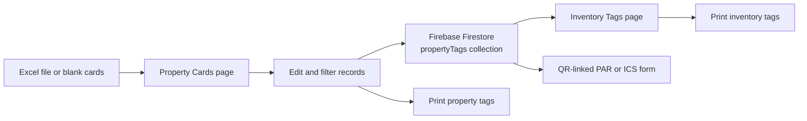

# UCN ProCard System

> A browser-based property card and inventory tag management system for the Supply and Property Management Office.

The UCN ProCard System helps staff create, update, search, save, and print government property records. It supports Excel imports, department filtering, QR-linked forms, property tags, and inventory tags.

Records are shared between the Property Cards and Inventory Tags pages through Firebase Firestore.

## Documentation

Choose the guide for your role:

| Guide | Audience | Contents |
|---|---|---|
| [User Guide](docs/USER-GUIDE.md) | Office staff and non-technical users | Daily workflows, Excel imports, editing, searching, and printing |
| [Developer Guide](docs/DEVELOPER-GUIDE.md) | Developers and maintainers | Setup, architecture, data model, deployment, and troubleshooting |

## Features

### Property Cards

- Import records from `.xlsx`, `.xls`, or `.csv` files.
- Add blank cards manually.
- Edit property information directly in the browser.
- Automatically save changes to Firestore.
- Search and filter records by department.
- Select, print, or delete cards in batches.
- Generate QR codes for saved property records.

### Inventory Tags

- View saved property records as inventory tags.
- Search by property number, article, serial number, department, or location.
- Edit tag information directly on the tag.
- Automatically assign missing inventory numbers.
- Print all visible tags or selected tags.

### Forms And QR Codes

QR codes open a printable form for the property record:

- Property numbers containing `SPLV` or `SPHV` open the Inventory Custodian Slip (`ics.html`).
- Other property numbers open the Property Acknowledgment Receipt (`par.html`).

## Quick Start

### Requirements

- [Node.js](https://nodejs.org/) for local development.
- Internet access for Firebase and the external browser libraries used by the application.
- A Firebase project with access to the `propertyTags` Firestore collection.

### Run locally

From the project folder, start the local server:

```powershell
npm start
```

Then open:

```text
http://localhost:3000
```

If port `3000` is busy, the server automatically tries the next available ports.

### Validate JavaScript

Run the syntax checks before committing changes:

```powershell
node --check "public/assets/js/main.js"
node --check "public/assets/js/inventory.js"
node --check "public/assets/js/print.js"
```

## Excel Import Summary

The importer reads the **first worksheet** and expects the column headings to begin on **row 5**.

Only rows classified as **Semi-Expendable** or **Non-Expendable** are converted into property cards. Expendable items are skipped.

Commonly recognized fields include:

| Field | Accepted examples |
|---|---|
| Classification | `Inventory/Property Classification` |
| Department | `Department` |
| Description | `Item Description`, `Description`, `Article`, `Item Name` |
| Property number | `Property No.`, `Item No.`, `Asset No.` |
| Quantity | `Quantity`, `Qty`, `No. of Units` |
| Unit | `Unit`, `Unit of Measure`, `UOM` |
| Date | `Date Acquired`, `Date Delivered`, `Acquired Date` |
| Cost | `Acquisition Cost`, `Unit Cost`, `Cost`, `Amount` |
| Reference | `P.O/J.O/Contract Ref`, `Reference No.`, `Contract Reference` |
| PAR or ICS number | `PAR No.`, `ICS No.`, `ICS/PAR No.` |

Header matching ignores capitalization and spaces, but column names must still describe the correct information.

## Application Flow



## Project Structure

```text
Property Card/
├── README.md                    Project overview and documentation index
├── package.json                 Node.js scripts
├── server.js                    Local static web server
├── firebase.json                Firebase Hosting configuration
├── .firebaserc                  Firebase project selection
├── docs/
│   ├── USER-GUIDE.md            Non-technical user instructions
│   └── DEVELOPER-GUIDE.md       Technical maintenance guide
	└── public/
		├── index.html               Property Cards page
		├── inventory.html           Inventory Tags page
		├── par.html                 Property Acknowledgment Receipt template
		├── ics.html                 Inventory Custodian Slip template
		├── 404.html                 Firebase Hosting not-found page
		└── assets/
			├── css/
			│   ├── styles.css       Property Cards styles
			│   └── inventory.css    Inventory Tags styles
			├── images/               Logos and image assets
			└── js/
				├── main.js          Cards, import, filtering, saving, and QR links
				├── inventory.js     Inventory tags, numbering, editing, and printing
				└── print.js          Property card print layout
```

## Technical Summary

| Area | Implementation |
|---|---|
| Front end | Static HTML, CSS, and browser JavaScript |
| Local server | Node.js built-in HTTP server |
| Data storage | Firebase Firestore collection `propertyTags` |
| Spreadsheet import | SheetJS loaded from a CDN |
| QR generation | QRCode.js loaded from a CDN |
| Hosting | Firebase Hosting configuration is included |
| API layer | None; browser code communicates directly with Firestore |

## Data And Safety Notes

- Firestore is the source of truth for saved property cards and inventory tags.
- Property card edits save automatically after a short delay.
- Inventory tag edits save when the edited field loses focus.
- The repository does not provide a backup or export workflow.
- Confirm print previews before large print runs.
- Protect the Firebase project with appropriate Firestore security rules and account access controls.

## Deployment

The repository includes Firebase Hosting configuration. A typical deployment is:

```powershell
firebase login
firebase use ucn-property-tag-b7e0a
firebase deploy --only hosting
```

Verify the selected Firebase project, Firestore rules, public URL, and production browser scripts before deploying because the application writes live operational records.

## Support And Maintenance

For everyday operation, start with the [User Guide](docs/USER-GUIDE.md).

For code changes, local setup, Firestore fields, deployment, and troubleshooting, use the [Developer Guide](docs/DEVELOPER-GUIDE.md).
