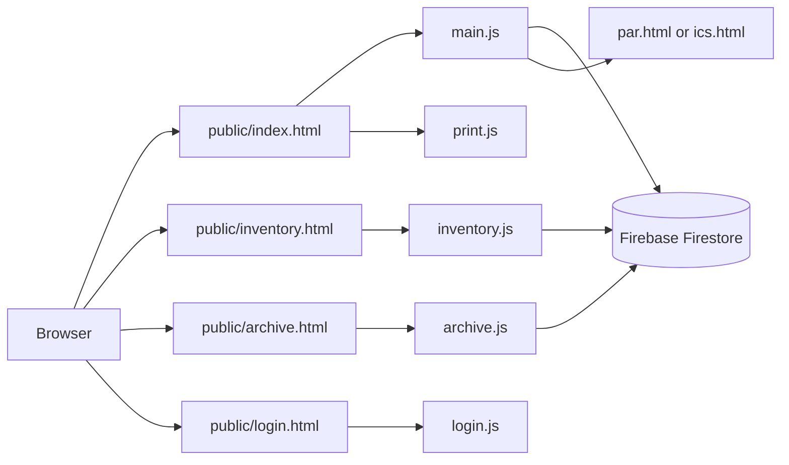

# UCN ProCard System Developer Guide

This guide is for developers who maintain, run, deploy, or extend the project.

## Overview

The project is a static browser application served by a small Node.js HTTP server. There is no application API in this repository. Browser JavaScript communicates directly with Firebase Firestore.

The main data collection is:

```text
propertyTags/{cardId}
archivedPropertyTags/{cardId}
```

The Property Cards and Inventory Tags pages use `propertyTags`. Archived cards are moved to `archivedPropertyTags` with the same document ID; QR form pages check the active collection first and then the archive.

Access is selected through `login.html`. The current implementation stores the normalized department in `sessionStorage`; **Remember me** additionally stores the department and preference in `localStorage`. This is a client-side access gate and is not a substitute for Firebase Authentication or Firestore security rules.

## Architecture At A Glance



The server only delivers static files. Firebase operations happen from browser JavaScript, so most functional changes belong in `public/assets/js/` rather than in `server.js`.

## Project Structure

```text
Property Card/
├── package.json                 Node scripts
├── server.js                    Local static web server
├── firebase.json                Firebase Hosting configuration
├── .firebaserc                  Firebase project selection
├── README.md                    Documentation index
├── docs/
│   ├── USER-GUIDE.md            Non-technical user documentation
│   └── DEVELOPER-GUIDE.md       This document
└── public/
    ├── index.html               Property Cards page
    ├── inventory.html           Inventory Tags page
    ├── par.html                 Property Acknowledgment Receipt template
    ├── ics.html                 Inventory Custodian Slip template
    ├── 404.html                 Firebase Hosting not-found page
    ├── login.html                 Department login page
    └── assets/
        ├── css/
        │   ├── login.css          Department login styles
        │   ├── styles.css       Property Cards styles
        │   └── inventory.css    Inventory Tags styles
        ├── images/               Logos and image assets
        └── js/
            ├── login.js          Department login and remembered access
            ├── main.js          Card state, import, editing, filtering, and saving
            ├── inventory.js     Inventory rendering, editing, numbering, and printing
            └── print.js         Property card print layout
```

## Local Development

### Requirements

- Node.js.
- Internet access for Firebase and external browser libraries loaded from CDNs.

There are currently no npm package dependencies.

### Start the server

From the project folder:

```powershell
npm start
```

The default port is `3000`. If that port is busy, `server.js` tries the next few ports automatically.

Open the URL printed in the terminal. The server serves files from `public/` and maps `/` to `public/index.html`.

### Useful local URLs

```text
/                  Property Cards page
/login.html         Department login page
/index.html        Property Cards page
/inventory.html    Inventory Tags page
/par.html?id=ID    Property Acknowledgment Receipt for a record
/ics.html?id=ID    Inventory Custodian Slip for a record
```

### Browser checks

When testing in a browser, inspect:

1. The Console for JavaScript and Firebase errors.
2. The Network panel for failed CDN or Firestore requests.
3. The Application/Storage panel for the `fieldColorMode` preference.
4. The Application/Storage panel for `propertyCardDepartment` and `propertyCardRememberLogin` when testing remembered access.
5. Print Preview for card dimensions, page breaks, and QR visibility.

### Check JavaScript syntax

```powershell
node --check "public/assets/js/main.js"
node --check "public/assets/js/inventory.js"
node --check "public/assets/js/print.js"
```

## Client-Side Responsibilities

### `main.js`

Owns the Property Cards page, including:

- Department definitions and card colors.
- Department-scoped access and the `MAIN` cross-department view.
- Loading records from Firestore.
- Creating blank cards.
- Importing Excel or CSV data.
- Card editing and auto-save.
- Search, department filtering, pagination, and selection.
- Card deletion.
- QR code generation.
- Links to PAR and ICS forms.

When the signed-in department is not `MAIN`, the department filter and per-card department selector are hidden. New cards and imported rows are assigned to the signed-in department, and records from other departments are excluded from the visible set.

Excel import starts at row 5 of the first worksheet. It imports rows whose `Inventory/Property Classification` contains `semi` or `non`, which is why Expendable records are skipped.

### `inventory.js`

Owns the Inventory Tags page, including:

- Loading `propertyTags` records.
- Search and department filtering.
- Department-scoped visibility, with cross-department filtering available to `MAIN` only.
- Inline contenteditable fields.
- Automatic inventory number assignment.
- Live Firestore updates.
- Lazy QR code rendering.
- Visible and selected inventory printing.

Missing inventory numbers are assigned using the current two-digit year and a four-digit sequence, such as `26-0001`. Writes are batched below Firestore's 500-write batch limit.

### `print.js`

Builds a temporary print-only sheet for property cards, groups ten cards per print page, copies card data and QR images, opens `window.print()`, and removes the temporary sheet afterward.

Inventory printing is implemented in `inventory.js` and also batches ten tags per print page.

### `par.html` and `ics.html`

These are printable document templates. The form selected for a QR link is based on the property number:

- Values containing `SPLV` or `SPHV` use `ics.html`.
- Other values use `par.html`.

### `login.js`

Handles department selection, password validation, the **Remember me** preference, and redirecting a successful login to `index.html`. Department names are normalized so legacy `GASS` values map to `MAIN`.

## Runtime Data Flow

### Property Cards

1. `main.js` initializes Firebase when the page loads.
2. Existing documents are read from `propertyTags`.
3. Cards are rendered in batches to keep the browser responsive.
4. User edits trigger a debounced save.
5. The saved record receives a QR URL based on its property number.
6. Print operations build a temporary print-only DOM structure.

Before this flow begins, `main.js` redirects visitors without a valid department session to `login.html`. The initial splash screen is held briefly while the page initializes.

### Inventory Tags

1. `inventory.js` redirects visitors without a valid department session to `login.html`.
2. `inventory.js` reads the same Firestore collection.
3. Missing inventory numbers are assigned and written back in batches.
4. Search and department filters operate on the loaded records.
5. Inline edits are written when the field loses focus.
6. QR codes are rendered lazily as tags become visible.
7. Printing builds a temporary inventory print sheet.

## Excel Import Mapping

The importer uses the first worksheet and starts reading data with row 5 as the header row. Header comparison removes spaces and ignores case.

| Application value | Primary or alternate headers |
|---|---|
| Classification | `Inventory/Property Classification` |
| Description | `Item Description`, `Items Description`, `Description`, `Article`, `Item Name`, `Property Description` |
| Property number | `Property No.`, `Property No./Item No.`, `Item No.`, `Asset No.` |
| Quantity | `Quantity`, `Qty`, `Qty.`, `No. of Units` |
| Unit | `Unit`, `Unit of Measure`, `UOM` |
| Date acquired | `Date Acquired`, `Date Delivered`, `Date of Acquisition`, `Acquired Date` |
| Cost | `Acquisition Cost`, `Unit Cost`, `Cost`, `Amount`, `Total Cost` |
| Reference | `P.O/J.O/Contract Ref`, `PO/J.O/Contract Ref`, `Reference`, `Reference No.`, `Contract Reference` |
| Person/location | `End-User/Location`, `End User`, `End-User`, `Location`, `User/Location` |

Rows are eligible when the normalized classification contains `semi` or `non`. Quantity and property-number ranges can create multiple cards from one spreadsheet row.

## Firestore Data Model

Common fields in `propertyTags/{cardId}` include:

```text
cardId
dept
color
quantity
unit
icsParNo
propertyNo
serialNo
serviceable
unserviceable
dateCounted
dateAcquired
acquisitionCost
fund
endUserLocation
requestedBy
supplier
reference
itemDescription
inventoryTag
coaRepresentative
propertyCustodian
qrUrl
savedAt
```

Archived documents in `archivedPropertyTags/{cardId}` retain these fields and add an `archivedAt` timestamp.

### Field groups

| Group | Fields |
|---|---|
| Identity | `cardId`, `propertyNo`, `icsParNo`, `inventoryTag` |
| Item details | `itemDescription`, `quantity`, `unit`, `serialNo` |
| Acquisition | `dateAcquired`, `acquisitionCost`, `fund`, `supplier`, `reference` |
| Responsibility | `endUserLocation`, `requestedBy`, `dateCounted`, `propertyCustodian` |
| Presentation | `dept`, `color`, `qrUrl`, `savedAt` |
| Inventory signatures | `coaRepresentative`, `propertyCustodian` |

There is no schema migration framework in this repository. New optional fields should be introduced defensively so older documents without the field continue to render correctly.

Department access is currently enforced by browser code only. Treat Firestore rules as the actual security boundary and do not rely on hidden controls or client-side filtering to protect data.

When adding a field, update every relevant boundary:

1. Card data collection and persistence in `main.js`.
2. Card rendering and editing in `index.html`/`main.js`.
3. Inventory rendering and editing in `inventory.js`, if the field belongs on tags.
4. Property card and inventory print layouts.
5. QR or form population if the field is part of a linked form.
6. Documentation and test coverage.

## Firebase Configuration

The Firebase browser configuration is currently duplicated in:

- `public/assets/js/main.js`
- `public/assets/js/inventory.js`

If the Firebase project changes, update both files consistently. Verify Firestore security rules separately; this repository does not contain those rules.

Hosting configuration:

- `firebase.json` serves the `public/` directory.
- `.firebaserc` selects the Firebase project `ucn-property-tag-b7e0a`.

### Firebase change checklist

When switching projects or environments:

1. Update the configuration in both browser scripts.
2. Confirm the Firestore project ID and Hosting project.
3. Verify Firestore rules permit the required reads and writes.
4. Test loading, editing, deleting, and inventory numbering.
5. Generate a QR code and confirm it opens the intended public URL.
6. Do not deploy until the target environment is confirmed.

## Deployment

A typical Firebase Hosting deployment is:

```powershell
firebase login
firebase use ucn-property-tag-b7e0a
firebase deploy --only hosting
```

Before deployment, verify the selected Firebase project, public URL, Firestore rules, and the intended version of the browser scripts. This application writes live operational records.

### Pre-deployment checklist

- [ ] `git diff --check` passes.
- [ ] All JavaScript files pass `node --check`.
- [ ] Property Cards load existing Firestore records.
- [ ] Inventory Tags load and display the same records.
- [ ] A property-card edit saves successfully.
- [ ] An inventory-tag edit saves successfully.
- [ ] QR links open the expected PAR or ICS form.
- [ ] Property and inventory print previews are readable.
- [ ] Firebase project and Firestore rules are verified.

## External Browser Libraries

The HTML pages load these libraries from CDNs:

- SheetJS (`xlsx`) for Excel and CSV parsing.
- Firebase App and Firestore compatibility SDKs.
- QRCode.js for QR generation.

A browser without network access may fail to import files, load records, or render QR codes.

## Troubleshooting For Developers

### Firestore records do not load

Check browser console errors, network access, Firebase initialization, project ID, and Firestore read permissions.

### Changes do not save

Property cards save after debounced input/change events. Inventory tags save on blur. Check the document ID, field name, Firestore update call, and write permissions.

### QR codes point to the wrong environment

The code falls back to the published application URL when running on localhost. Review `getPublicBaseUrl()` and the generated `qrUrl` before testing QR codes from a local server.

### Import produces no cards

Verify that the first worksheet has headings on row 5 and that the classification value contains `semi` or `non`. Header matching removes spaces and ignores case, but it does not infer arbitrary column meanings.

### Print layout is misaligned

Check browser print settings first. Then inspect the print CSS and the ten-card page batching in `print.js` or `inventory.js`. Keep card dimensions and grid gaps synchronized with the print styles.

### A change appears locally but not in Firestore

Check whether the record has a valid `cardId`, whether Firebase initialized successfully, and whether the write promise reports an error. Test with a known existing document before changing rendering code.

### Inventory numbers are duplicated

Inspect existing `inventoryTag` values and confirm that assignment is running against the current collection snapshot. Do not manually rerun numbering without checking the existing year prefix and sequence values.

### A page works locally but not after deployment

Check relative asset paths, CDN availability, Firebase Hosting output, the production hostname used by `getPublicBaseUrl()`, and browser caching caused by version query strings.

## Change Workflow

For a small feature or bug fix:

1. Identify the owning page and script.
2. Reproduce the behavior in a local browser.
3. Make the smallest focused change.
4. Run JavaScript syntax checks and `git diff --check`.
5. Test the affected workflow with Firestore connected.
6. Test print output if the change affects card dimensions or content.
7. Update the user guide when visible behavior changes.
8. Update this guide when architecture, setup, or data behavior changes.

Avoid editing generated or unrelated files. Preserve existing Firestore field names unless a migration plan exists.

## Operational Risks And Maintenance Notes

- Firestore is the source of truth for saved records.
- The repository does not provide a backup or export workflow.
- Firebase configuration appears in browser code; protect the project through proper Firestore security rules and Firebase project access controls.
- Test imports with a copy of production spreadsheets.
- Confirm print output before large print runs.
- Keep the user guide updated when visible workflows or button names change.
- Avoid exposing additional sensitive data in QR URLs; QR links currently identify records through a document ID.
- Treat changes to print dimensions, Firestore fields, and Firebase configuration as higher-risk changes requiring end-to-end testing.
